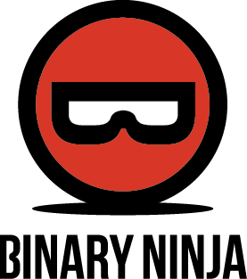
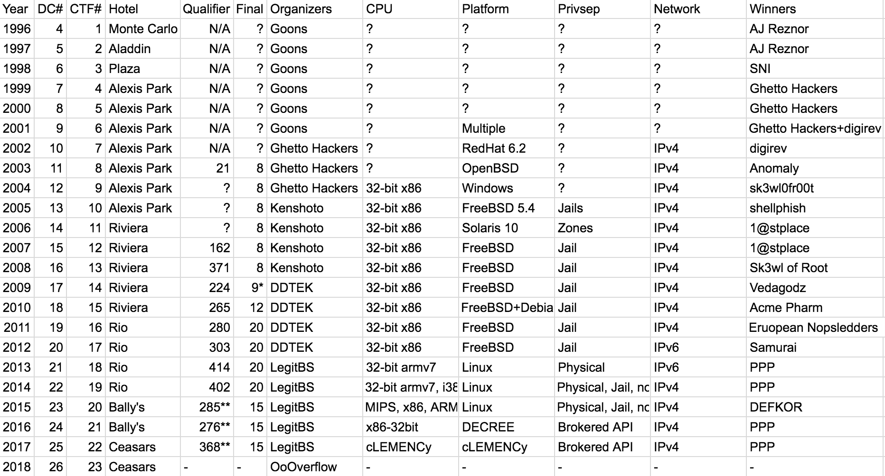
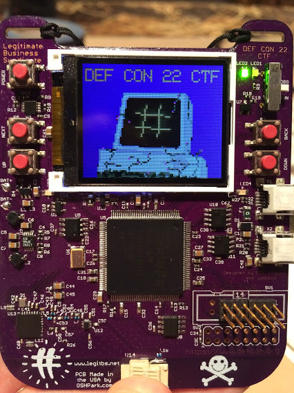
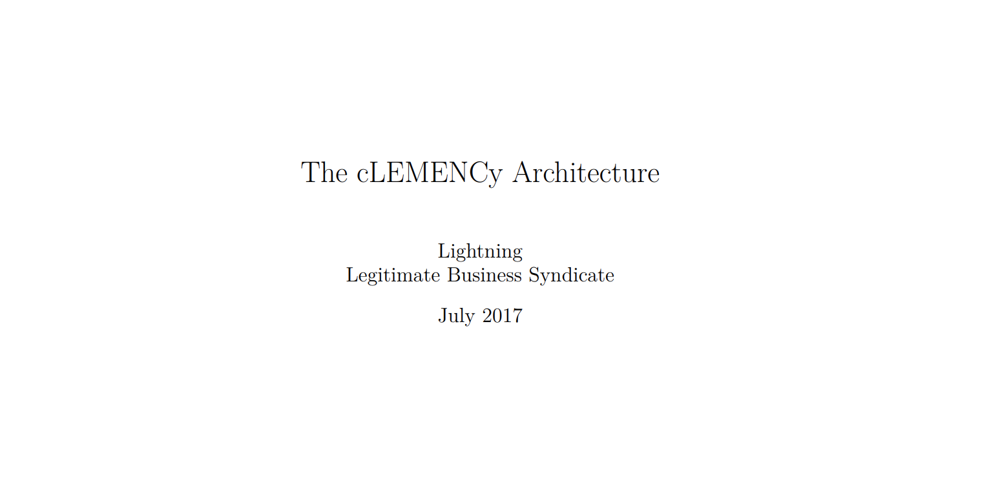

<!-- .slide: data-background="images/ctf.jpg" -->
# A Brief History of CTF

<small>[@psifertex](https://twitter.com/psifertex)</small>

note: Talk slowly!

--

<!-- .slide: data-background="images/ctf.jpg" -->
# Challenge!


```$ ssh insomnihack@ictf.psifertex.com #pw: insomnihack```

note: Challenge doesn't work with my payload, but it was 5am when I got it running so I didn't have much time to troubleshoot. If you can read `/flag` and follow the directions, I have a marvelous prize for you.

--

<!-- .slide: data-background="images/un.jpg" -->
# UNbio

A non-exhaustive list of things I am NOT:

- the best CTF player (talk to Loki or Geohot)
- the winningest DEF CON player (talk to PPP)
- the organizer of the longest running CTF (talk to Shellphish)
- the longest-continuous CTF player (talk to Chris Eagle)
- even a currently active CTF player (thus, "history")

Notes: No this is not my United Nations Biography, that's my un-bio -- a list of things that I am not. (Yes, be prepared for bad puns)

--

<!-- .slide: data-background="images/face.jpg" data-background-size="20%" data-background-position="bottom right" -->
# Bio

- ten years of playing DEF CON CTF finals (even won a few times)
- helped build [CGC](http://archive.darpa.mil/cybergrandchallenge/)
- captain of team behind [Ghost in the Shellcode](http://ghostintheshellcode.com/)
- creator of [captf.com](https://captf.com/), a collection of archived CTF challenges
- erstwhile organizer of the [Golden Flag Awards](http://golden-flags.com/)
- one of the devs of 

Notes: a non-exhaustive list of some of the things I have done though that are relevant to this talk. 

--

<!-- .slide: data-background="images/survey.jpg" -->
# Survey

- Who has heard of CTF?
<!-- .element: class="fragment" -->
- Who has played a CTF?
<!-- .element: class="fragment" -->
- Who knows their team's current ctftime rank?
<!-- .element: class="fragment" -->
- Who has organized a CTF?
<!-- .element: class="fragment" -->
- Who has retired from CTF because they got old and irrelevant?
<!-- .element: class="fragment" -->

Notes: A disclaimer -- my view of CTF is of course skewed by the CTFs I have participated in. I'd love to hear more though from others about things I don't know. I worry that much of our community is currently in the folk-lore stage, or on old blog that are eventually lost and I'd like to make sure we do a better job keeping some historical record of our past. I think too many people take it for granted that the internet saves everything when it, in actuality, does not.  If you've retired, come find me after this talk, we'll put together an old-person's team for the CTF this evening maybe. :-P 

--

<!-- .slide: data-background="images/ctf4.jpg" -->
# Types of CTF

- Blue Team (CCDC, CDX)
- Red Team  (Jeopardy, Game-board)
- Full Spectrum / Attack-Defense

Notes: I'm sure this is old news to most everyone, but most CTFs can be categorized into three different styles. Blue team, or defensive CTFs are, in my opinion, the most boring of all and thankfully from what I can tell seem to be only a disease that has infected the US, with Europe and Asia not wasting a lot of time on them. Red team or pure offensive CTFs are sometimes jeopardy style or gameboard, are pure solving or offensive challenges. The most complicated and stressful are the full spectrum or attack-defense CTFs where you are actively engaged in both attack and defense.

---

<!-- .slide: data-background="images/vintage_phone.jpg" -->
# In the beginning...

Notes: We submitted keys via DTMF (actually happened in DefCon 14). But actually, the earliest CTFs are much older than that. DEF CON though still gets a lot of publicity as one of the biggest events, and as far as I know, the longest running CTF, though the organizers have changed several times.

---

<!-- .slide: data-background="images/defcon.png" -->
# DEF CON Timeline




Notes: here's an overview of the different events, don't want to cover them all, but here are a few of my favorite highlights. Raw URL: https://docs.google.com/spreadsheets/d/1xy_Yak_rbYO1g0di54bNrHD3uoK0F6insWAOPgFvM08/edit?usp=sharing

--



Notes: Badger was a beautiful piece of design released DEF CON 22. I know that badge design especially at DEF CON is itself now an entire subculture of its own right, but this badge pre-dated the influx of common badges, and even amongst all the cool designs this still remains one of the most impressive. Routards the only team to land, great team of CTF players who unfortunately were always so close to winning and always seemed to end up getting second place. Xilinx Spartan 6

http://www.routards.org/2014/08/defcon-22-ctf-badger.html
<!-- https://legitbs.net/2014/ -->
# Badger


--



Notes: crazy amount of work went into clemency, development started over a year and a half before it was released

- https://github.com/legitbs/cLEMENCy
- https://blog.legitbs.net/2017/10/clemency-showing-mercy.html
- https://2017.notmalware.ru/89dc90a0ffc5dd90ea68a7aece686544/clemency-201707271159.pdf

---

<!-- .slide: data-state="chart1" -->
# Total CTFs

<canvas id="chart1" width="800" height="400"></canvas>

Notes: Numbers extracted from CTFTime's archive section

---

<!-- .slide: data-background="images/scoreboard.jpg" -->
# Scoring Mechanisms
(attack defense)

- service pollers
- crypto backdoor
- out-of-band, or in-band?

Notes: arguably one of the hardest, and most important things to get right. There's a lot of different ways to do it so here's my biased descriptions. Service pollers are notoriously easy to game and hard to get right in attack defense. 

--

<!-- .slide: data-background="images/scoreboard.jpg" -->
## Scoring Mechanisms
(jeopardy)

- self-adjusting?
- unique flags?

Notes: much easier problems to deal with compared to attack defense -- possibly unique key values if possible to detect/mitigate collusion, self-adjusting scores help author-bias

--

<!-- .slide: data-background="images/superman.jpg" -->
## Superman Defenses

- service redirection
- syscall filtering
- virtualized services
- network shenanigans

Notes: any time you give the defenders lots of control over their environment (or even just sufficient advance notice about the environment), they can always come up with really neat generic defenses. From back in the early defcon days when Immunix fielded a custom hardened Linux operating system to generically protect services (early form of AppArmor), to many of the more recent attack-defense CTFs where a huge number of techniques have been applied. 

---

<!-- .slide: data-background="images/world.jpg" -->
# Real World Impact

Notes: go see infiltrate talk

---

<!-- .slide: data-background="images/games.jpg" -->
# Gamification

Notes: if you've seen my infiltrate talk you've seen a bunch of examples of the intersection between gaming and CTFs, but I think there's a /TON/ more work to be done in this area. Here's a quick highlight of some of my favorites. PlaidCTF included a game-type interface to their ctf in 2012 and 2013, but the CTF itself wasn't really about the game interface at all.

--

<!-- .slide: data-background="images/zork.jpg" -->
# Choose Your PwnAdventure

```You are eaten by a grue.```

Notes: A pure text-based game

--

<!-- .slide: data-background="images/bear_wine.jpg" -->
# PwnAdventure 2

Notes: Unity based, dot-net is good for easy access to decompilers. In fact, it sounds like the upcoming CTF later tonight has a Unity based engine in it, so definitely make sure to check that out. 

--

<!-- .slide: data-background="images/pa3.png" -->
<iframe data-src="https://www.youtube-nocookie.com/embed/PHZJ443zVM0?autoplay=1&amp;controls=0&amp;showinfo=0&amp;start=43" width=800 height=600></iframe>

Notes: PwnAdventure 3:
Unreal Engine definitely harder to reverse engineer than PwnAdventure2, just finished a reverse engineering workshop that uses a modified version of this game, but you don't have to take our workshop to play with it, see the slide notes for the URL where you can download the older version of the game. https://pwnadventure.com/

--

<!-- .slide: data-background="images/paz.gif" -->
## PwnAdventureZ

Notes: For 30th anniversary of NES (2015), developed PwnAdventureZ

--

<iframe data-src="https://www.youtube-nocookie.com/embed/G6t94p2anVA?autoplay=1&amp;controls=0&amp;showinfo=0&amp;start=43" width=800 height=600></iframe>

Note: you can try playing PwnAdventureZ outside as SCRT has setup an original NES console to play on! Note that because of the NTSC/PAL differences unfortunately the sound isn't quite right and it plays about 20% slower than normal, but otherwise should be just fine.

---

# Visualizations

Note: get it, a slide on visualizations that's the only blank one?! I AM HILARIOUS. 

Visualizations are near and dear to my heart. There's been a long history of visualizations at CTFs though they almost all focus on the scoreboard. I think we can do better as a community by trying to come up with more interesting ways of visualizing CTFs to make them more approachable.

--

<!-- .slide: data-background="images/2002-defcon-scoreboard.png" data-background-size="contain" data-background-repeat="repeat" -->
# Early Scoreboards

Notes: lots of CTFs have scoreboards, they've been around for over 15 years now. Some early oens at DEF CON were even broadcast over the hotel's TV system to keep track no matter where you were. Not everyone had a cell phone they could surf the web with then I suppose. 


--

<iframe data-src="https://www.youtube-nocookie.com/embed/3u5u5A8_SE0?autoplay=1&amp;controls=0&amp;showinfo=0&amp;start=43" width=800 height=600></iframe>

Notes: NICT's Daedalus has been used in a number of Japanese CTFs and is probably one of the flashiest looking interfaces.

--

<iframe data-src="https://www.youtube-nocookie.com/embed/NHArWZ887ns?autoplay=1&amp;controls=0&amp;showinfo=0&amp;start=0" width=800 height=600></iframe>

Note: Cyber Grand Challenge visualization.

--

<iframe data-src="https://www.youtube-nocookie.com/embed/2fk71DBw_lk?autoplay=1&amp;controls=0&amp;showinfo=0&amp;start=81" width=800 height=600></iframe>

Note: Filament View

Full list of DARPA visualization videos: https://www.youtube.com/playlist?list=PL6wMum5UsYvZx2x9QGhDY8j3FcQUH7uY0

--

<iframe data-src="https://www.youtube-nocookie.com/embed/D7uXE_lEzxI?autoplay=1&amp;controls=0&amp;showinfo=0&amp;start=1653" width=800 height=600></iframe>

Notes: Live CTF
Originally popularized by GeoHot, I love the idea of LiveCTFs. There's so much potential here, though unfortunately it's a lot of work to get going up. The biggest obstacles are getting challenges of the right length, and then the logistics of trying to do 
livectf REDEMPTION by geohot 7/27/2014
https://www.youtube.com/watch?v=td1KEUhlSuk

Bad audio from DEF CON: https://www.youtube.com/watch?v=Jux_wKjTYws

--

<iframe data-src="https://www.youtube-nocookie.com/embed/Jux_wKjTYws?autoplay=1&amp;controls=0&amp;showinfo=0&amp;start=1337" width=800 height=600></iframe>

Notes: Live CTF

---

<!-- .slide: data-background="images/cgc.png" data-background-size="contain"  -->
# Cyber Grand Challenge

Notes: mentioned during visualization, but there's a lot more to CGC: automation, reaction, scale

Analysis Recap Video: https://www.youtube.com/playlist?list=PL6wMum5UsYvZx2x9QGhDY8j3FcQUH7uY0

---

<!-- .slide: data-background="images/storytime.jpg" -->
# Story Time!

A quick summary of some of my favorite stories -- let me know yours, I'd love to archive/collect these.

--

<!-- .slide: data-background="images/antenna.jpg" -->
# Antenna Fun

Notes: Hates Irony brought some military grade RF gear to the Rio only to find out that the foil covering on the windows to keep the sun out also does a great job keeping whatever frequencies out we were trying to use as well. The goal was a point-to-point network between a hotel suite and the game floor. For a long time, reliable networking between any players at the table at DEF CON and those that were remote was very difficult so we thought we'd fix that. Unfortunately, not only did the foil stop the signal, but the hotel security wasn't particularly happy with our teammates that were driving around the property, hopping out and pointing a giant antenna up at one of their hotel towers. They had a fun chat that was even caught on camera by someone else and posted to twitter.

But while the antenna didn't work for our p2p network, we did come up with another fun idea. Fake Van Eck Phreaking!

--

<!-- .slide: data-background="images/tables.jpg" -->
# Coming out of the closet

Notes: One of the most precious commodities in an attack-defense CTF can be privacy and quiet. The CTF floor is often loud, distracting, but at the same time, that's where all the data is, so trying to set up a remote team doesn't work so well.

--

<!-- .slide: data-background="images/tools.jpg" -->
# Tool Breaking

 - libpcap / wireshark
<!-- .element: class="fragment" -->
 - flooding listeners
<!-- .element: class="fragment" -->
 - curl command-injection (9447 v. hates irony, samurai v. apt8)
<!-- .element: class="fragment" -->

Notes: long history of teams breaking the tools of other teams in attack-defense CTFs

--

<!-- .slide: data-background="images/guitar-hero-logo.jpg" data-background-size="contain"  -->
# Guitar Hero Ownage

Notes: in-memory patcher and backdoor, because of drop-privs being the wrong order, huge lead, took time off to chill and play Guitar Hero they had such a lead (and hadn't even submitted all their flags until right before the game ended)

--

<!-- .slide: data-background="images/epic.jpg" -->
# Nearly EPIC

 - asterisk scoreboard
<!-- .element: class="fragment" -->
 - cLEMENCy breakout
<!-- .element: class="fragment" -->
 - Crypto Backdoor
<!-- .element: class="fragment" -->

Notes: long and storied tradition of infrastructure breaking, here's some /nearly/ epic hacks that all failed.

--

<!-- .slide: data-background="images/adc.jpg" -->
# Actually EPIC

```
=============================================================================
FreeBSD-SA-11:05.unix                                       Security Advisory
                                                          The FreeBSD Project

Topic:          Buffer overflow in handling of UNIX socket addresses

Category:       core
Module:         kern
Announced:      2011-09-28
Credits:        Mateusz Guzik
Affects:        All supported versions of FreeBSD.

[...]

II.  Problem Description

When a UNIX-domain socket is attached to a location using the bind(2)
system call, the length of the provided path is not validated.  Later,
when this address was returned via other system calls, it is copied into
a fixed-length buffer.

Linux uses a larger socket address structure for UNIX-domain sockets
than FreeBSD, and the FreeBSD's linux emulation code did not translate
UNIX-domain socket addresses into the correct size of structure.
```

Notes: lollerskaters from rofl copters dropped an epic BSD escape to cause major havoc in 2011

--

<!-- .slide: data-background="images/fnat.png" -->
# TCP/IP Shenanigans

Notes: there was another clever hack that same year that wasn't quite as interesting but turned out to be quite helpful. Bellovin's research, didn't work to completely identify service poller, blocked specific throwing boxes such as the lollerskater's thrower.

--

<!-- .slide: data-background="images/troll.jpg"  -->
# Troll Challenges!

 - "TrustMe"
<!-- .element: class="fragment" -->
 - HackerBook
<!-- .element: class="fragment" -->
 - experiment [BCTF 2015](https://docs.google.com/presentation/d/16m4D-fZyXypKPBb_H0F-Iov2TI_bSKYZhygP6GIi_dk/edit#slide=id.gcb4107855_0_681)
<!-- .element: class="fragment" -->
 - HITCON "Perfection"
<!-- .element: class="fragment" -->

Notes: Troll challenges are when the organizers get to hack the participants back, or at least mess with them a little bit.

RunMe style challenges have cropped up many times over the years, they're usually a heavily obfuscated/armored binary that is difficult to reverse, but it demands increasingly more control or data from your system. They might want to run as root, do verification to see that they're not running in a virtual machine, ask for a USB webcan to be plugged in, record audio from a mic, etc. Often times at the end of all of this, they will simply reveal a flag.  (TrustMeMore, from GITS, https://gist.github.com/withzombies/8514724, )

HackerBook (https://ctftime.org/task/227) had several possible solutions (including one unintended), but one possible solution was to just type in the name of a bunch of hackers whose faces were shown in photos. k

Perfection was an entire category of troll challenges at HITCON that were designed to break existing tools. Impeccable Artifact, for example, was specifically designed to abuse a bug in libseccomp to hide a subtle backdoor.

--

<!-- .slide: data-background="images/servers.jpg"  -->
# Servers Need Power
Notes: power cable versus shoe

---

<!-- .slide: data-background="images/volunteer.png" class="higher" -->
# Contributing
<!-- .element: class="higher" -->

Notes: there's a lot of work that could benefit the community. If you've had your life made better by playing CTFs (and I know many of us have) then I strongly encourage you to give back by helping out the community, there's lots of ways! 

--

# captf.com

<iframe src="https://captf1.captf.com/" width="800" height="600" />

Notes: could definitely use someone to help me scrounge up more CTFs to mirror, they're a precious resource, let's not lose them! 

--

<!-- .slide: data-background="images/tools.jpg" -->
# Write Tools!

Note: Lots of great tools have origins in the CTF community. Many crypto apps, pwntools, QIRA, even Binary Ninja was originally a private Hates Irony tool written in Python before it was rewritten. Even if you don't want to poblish your tools while you are competing, as soon as you get too old for CTF like me, then you can release your code for everyone to benefit from.

--

<!-- .slide: data-background="images/mentor.jpg" -->
# Mentor

Note: There's always someone who is further along and always someone further behind. Look for those you can help and playing in a team helps you find others who can help you too. 

--

<!-- .slide: data-background="images/ctf2.jpg" -->
# Run a CTF

Note: It's a ton of work, but well worth it. Only way to get better at it is to simply do it.

--

<!-- .slide: data-background="images/goldenflags.png" -->
http://golden-flags.com/

--

<!-- .slide: data-background="images/ctftime.png" -->
# ctftime 2.0? 

- Federated login
- Individual stats
- Community-directed
 - ranking system
 - event scoring
- host writeups/mirrors locally

Notes: debate comes up every year or two and is debated heavily. kyprizel does a great job of it, but it feels like it should be more of a community resource, though that supposes the community is actually willing to step it up 
---

<!-- .slide: data-background="images/credit.jpg" -->
# CREDITS (1/2)

- [Lovely series of CTF photos from Wikihow](https://www.wikihow.com/Play-Capture-the-Flag) licensed [(CC) by-nc-sa](https://creativecommons.org/licenses/by-nc-sa/3.0/)
- Slides created with [reveal.js](https://revealjs.com/#/) and [reveal-md](https://github.com/webpro/reveal-md)
- Other slide backgrounds from various CC licensed material, exact URLs available in github repository
- CTF Organizers world-wide -- very few people know how much of your time, effort, and often times cash go into these events which can be very ephemeral events. It's truly a labor of love and the community benefits a ton from it!

---

<!-- .slide: data-background="images/credit.jpg" -->
# CREDITS (2/2)

- [redford](https://twitter.com/DragonSectorCTF)
- [@sk3wl](https://twitter.com/sk3wl)
- [@tylerni7](https://twitter.com/tylerni7)
- [@r3v](https://twitter.com/evilmegacorp)
- My many CTF teammates, especially [@eipwned](https://twitter.com/eipwned), the solo developer of most of PwnAdventure series

Notes: Thanks to these fine folks for their ideas, stories, and review of the slides. k

---

<!-- .slide: data-background="images/questions.jpg" -->
# Questions?

SLIDES: https://github.com/psifertex/a-brief-history-of-ctf

[(CC) by-nc-sa](https://creativecommons.org/licenses/by-nc-sa/3.0/)

---

# Bonus Content

- CTF Resources/References

---

## Resources (1/3)

- https://www.defcon.org/html/links/dc-ctf-history.html
- https://ctftime.org/ (main website for event tracking)
- https://trailofbits.github.io/ctf/ (CTF field guide)
- http://captf.com/maxims.html (organizer guide)

--

## Resources (2/3)

- https://www.youtube.com/watch?v=8ev9ZX9J45A (And any other video by LiveOverflow)
- https://github.com/ctfs (Writeup archive)
- https://ctfs.github.io/resources/
- https://github.com/pwning/docs/blob/master/suggestions-for-running-a-ctf.markdown

--

## Resources (3/3)

- http://captf.com/practice-ctf/ (Wargames/practice)
- https://www.youtube.com/watch?v=okPWY0FeUoU (old DEF CON talk of mine)
- https://www.youtube.com/watch?v=O8oJ5CMXo3k (Kenshoto behind the scenes)
- https://www.blackhat.com/presentations/bh-asia-04/bh-jp-04-pdfs/bh-jp-04-eller/bh-jp-04-eller.pdf (GH's captain)
- https://www.youtube.com/watch?v=MbIDrs-mB20 (DEF CON CTF organizer panel)

---

<!-- .slide: data-background="images/ctf.jpg" -->
# Challenge!

If no one solved the previous challenge, first person to shout the answer to one wins:

```____ ___ ______```

---

<!-- .slide: data-background="images/pwnadventurez.jpg" -->

<iframe data-src="https://www.youtube-nocookie.com/embed/QXLP-L2ZgpQ?autoplay=1&amp;controls=0&amp;showinfo=0&amp;start=844" width=800 height=600></iframe>

Notes: The "proper" runthrough as intended was much longer!
